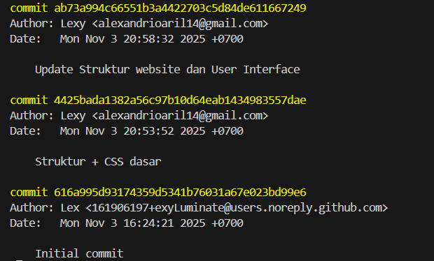
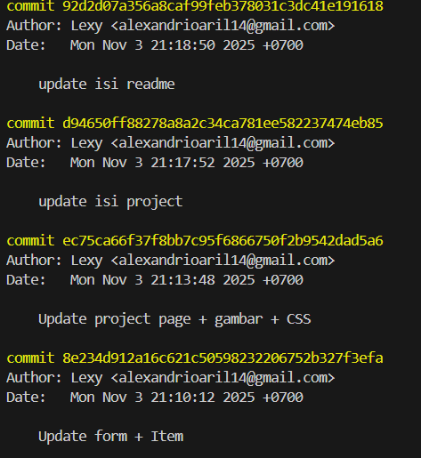
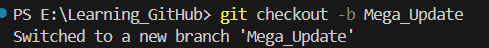
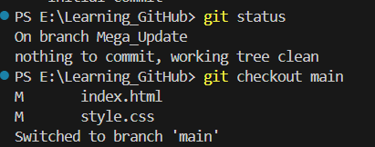
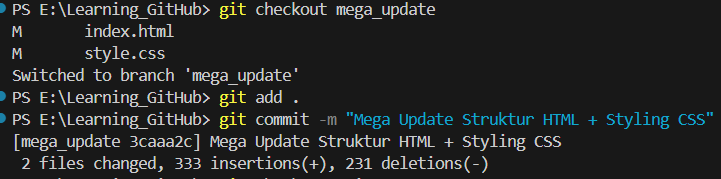
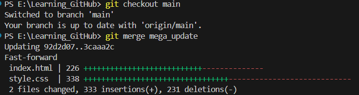
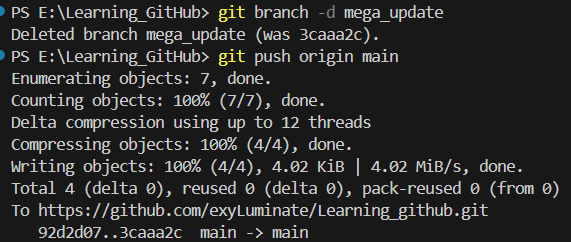

# 🌐 Personal Portofolio Website

Sebuah website portofolio pribadi yang dibuat menggunakan HTML, dan CSS sederhana.  
Website ini berfungsi sebagai media untuk memperkenalkan diri, menampilkan pengalaman, proyek, serta kontak profesional.

Link : https://exyluminate.github.io/exyLuminate/
---

## 🚀 Fitur Utama

- **Home Section** — Menampilkan perkenalan singkat dan foto profil.  
- **Resume Section** — Berisi pengalaman kerja, organisasi, dan keterampilan .  
- **Projects Section** — Menampilkan daftar proyek beserta deskripsi dan gambar.  
- **Contact Section** — Formulir kontak yang dapat diisi untuk menghubungi pengembang.  
- **Responsive Design** — Tampil rapi di perangkat desktop maupun mobile.  
- **Smooth Navigation** — Navigasi antar section dengan animasi scroll lembut.  

---

### 📦 Instalasi

Ikuti langkah-langkah berikut untuk menyalin proyek ini ke komputer kamu:

#### 1️⃣ Clone Repository
Buka terminal atau Git Bash, lalu jalankan:

git clone https://github.com/exyLuminate/PemrogramanWeb.git

#### 2️⃣ Masuk ke folder projek 

cd PemrogramanWeb

#### 3️⃣ Buka di Browser
start index.html

##### Teknologi yang Digunakan

HTML5 — Struktur halaman
CSS3 — Styling dan layout responsif
Font Awesome — Ikon sosial media

##### Log History

**1. Initial Commit + Kerangka Dasar Website**

**2. Update Struktur + merge master ke main**

**3. Update HTML  + content web (project+readme+gambar)**

**4. Membuat branch mega_update dan berpindah ke branch**

**5. Mengecek working branch dan kembali ke main**

**6. pindah ke branch dan melakukan update html + css serta commit**

**7. pindah ke main dan melakukan merge dari branch mega_update**

**8. Menghapus branch mega_update karena sudah tidak digunakan**

**9. Melakukan Update readme setelah merge dari branch**
